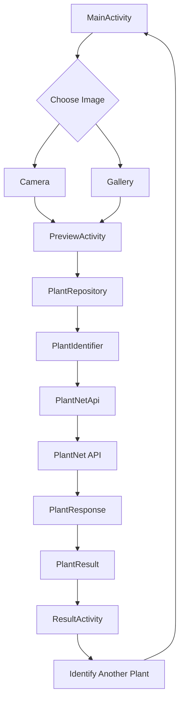

# FloraScan — Simple Application Architecture

## Application Architecture

## Application Flow

MainActivity

→ Camera / Gallery

→ PreviewActivity

→ PlantRepository

→ PlantIdentifier

→ PlantNetApi

→ PlantNet API

→ ResultActivity

## Project Structure

com.florascan.app/

- MainActivity.java
- PreviewActivity.java
- ResultActivity.java

- repository/
  - PlantRepository.java

- service/
  - PlantIdentifier.java

- network/
  - PlantNetApi.java
  - RetrofitClient.java

- model/
  - PlantResponse.java
  - PlantResult.java

- utils/
  - ImageUtils.java

## Responsibilities

### MainActivity

- Open camera
- Open gallery
- Get selected image

### PreviewActivity

- Show selected image
- Start plant identification
- Show loading state
- Show errors if needed

### ResultActivity

- Show plant name
- Show scientific name
- Show confidence
- Show family
- Show genus
- Identify another plant

### PlantRepository

- Keep API logic separate from Activities
- Connect the UI layer with the plant identification service
- Return cleaned plant results

### PlantIdentifier

- Define a simple plant identification interface
- Keep the recognition provider replaceable

### PlantNetApi

- Define PlantNet API requests
- Upload plant images

### RetrofitClient

- Create and configure the Retrofit client
- Handle API connection settings

### PlantResponse

- Store the raw PlantNet API response

### PlantResult

- Store the cleaned plant identification result used by the UI

### ImageUtils

- Resize and compress images
- Prepare images for upload

## Scalability Considerations

- Repository layer keeps UI and data access separated
- PlantIdentifier allows the recognition provider to be replaced later
- Image compression reduces upload size and network usage

For a production system, third-party API access could later be moved behind a backend for API key protection, caching, rate limiting, monitoring, and provider failover.
